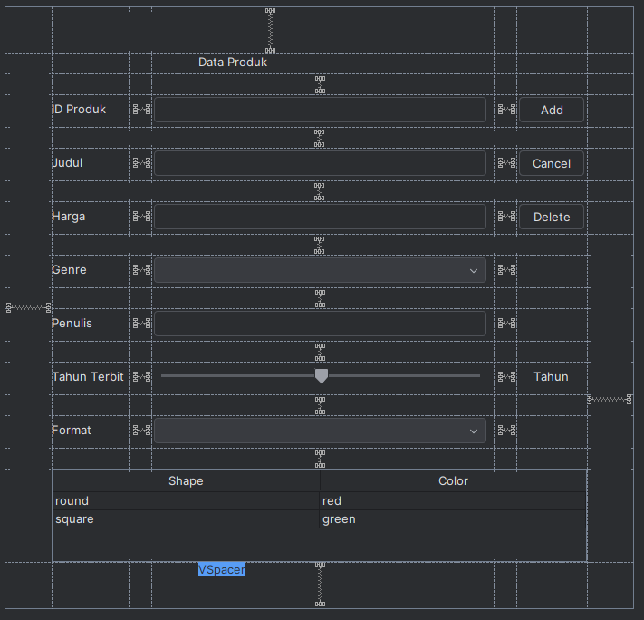

# Tugas Praktikum 4
## Janji
Saya Muhammad Attala Rafikasya dengan NIM 2403310 mengerjakan Tugas Praktikum 4 dalam mata kuliah Desain Pemrograman Berbasis Objek untuk keberkahanNya maka saya tidak melakukan kecurangan seperti yang telah dispesifikasikan.

## Desain Program
Program ini adalah program untuk mengelola produk dengan fitur CRUD dasar menggunakan Java Swing sebagai GUI. Ada dua kelas di dalam program ini, yaitu :
### 1. Product
Class untuk merepresentasikan data product khususnya untuk product buku.
Atribute
- String id;
- String judul;
- double harga;
- String genre;
- String penulis;
- int tahunTerbit;
- String format;
Method
- Get Set untuk semua atribut

### 2. ProductMenu extends JFrame
Class ini berisi GUI dari program, berfungsi sebagai interface program dengan pengguna. Selain berisi atribut dan method untuk GUI, class ini juga berisi setTable, insertData, updateData, deleteData, clearForm, dan populateList.

## Desain GUI

## Alur Program
1. Memulai Aplikasi
- Pengguna menjalankan aplikasi.
- Jendela utama menampilkan Form Data produk dan Tabel data produk.

2. Menabahkan Produk
- Mengisi form produk, pengguna mengisi ID Produk, Judul, Harga, Genre, Penulis, Tahun Terbit, dan Format.
- Pengguna menekan tombol "Add".
- Data yang baru dimasukan akan otomatis masuk kedalam tabel.

3. Mengedit Produk
- Pengguna memilih data produk yang akan diubah.
- Form akan otomatis terisi dengan data yang akan diubah.
- Pengguna akan mengubah data di dalam form.
- Pengguna lalu menekan tombol "Update".
- Data diperbaharui dalam table.

4. Menghapus Produk
- Pengguna memilih data produk yang akan dihapus.
- Pengguna lalu menekan tombol "Delete"
- Muncul jendela konfirmasi untuk menghapus data.
- Data produk akan dihapus.

5. Menampilkan Produk
- Setiap aplikasi dibuka atau ada perubahan data, tabel otomatis akan diperbaharui.

## Dokumentasi
